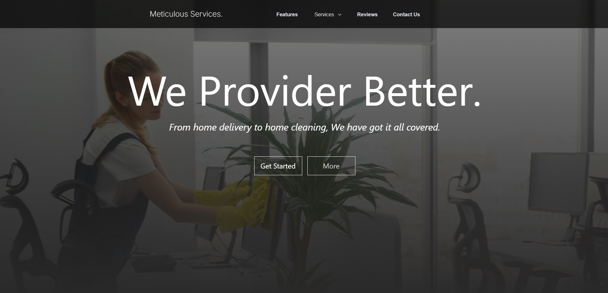
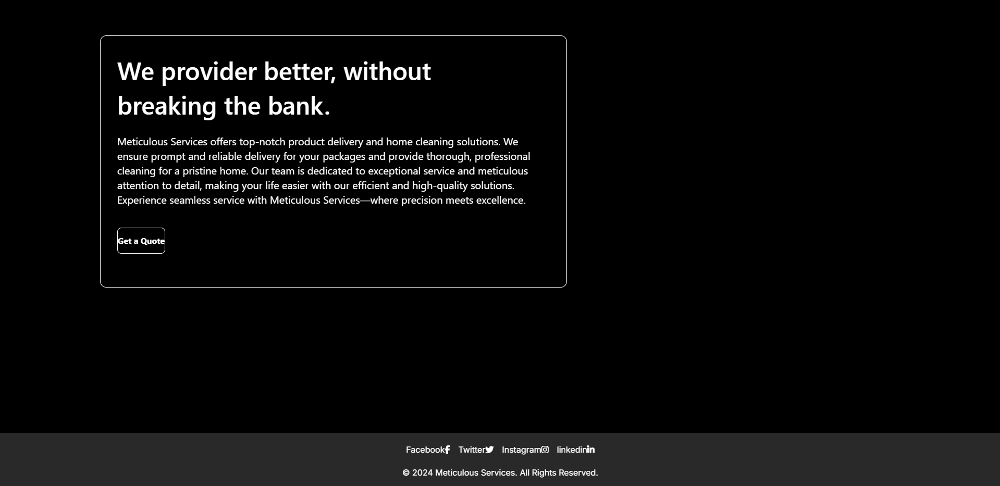

# Meticulous Services Web App


## Table of Contents

- [Introduction](#introduction)
- [Features](#features)
- [Technologies Used](#technologies-used)
- [Getting Started](#getting-started)
  - [Prerequisites](#prerequisites)
  - [Installation](#installation)
  - [Running the App](#running-the-app)
- [Screenshots](#screenshots)
- [Contributing](#contributing)
- [License](#license)
- [Contact](#contact)

## Introduction

Meticulous Services is a web application that offers professional product delivery and home cleaning services. Our mission is to provide reliable, timely, and thorough services that meet the highest standards of quality. The web app allows users to explore the services we offer, get a quote, and contact us for more information.

## Features

- **Responsive Design:** The web app is designed to be fully responsive and accessible on various devices, including desktops, tablets, and mobile phones.
- **Service Details:** Detailed descriptions of the services we offer, including product delivery and home cleaning.
- **Contact Form:** A contact form for users to get in touch with us directly through the website.
- **Owner's Information:** A dedicated section that provides information about the founder and CEO, Muhammad Salman.

## Technologies Used

- **Frontend:** React, Next.js, Tailwind CSS, Material Tailwind
- **Backend:** Next.js API routes (for future features)
- **Styling:** Tailwind CSS, Material Tailwind
- **Images:** Optimized with `next/image`

## Getting Started

### Prerequisites

- Node.js (>= 14.x)
- npm or yarn

### Installation

1. **Clone the repository:**

   ```bash
   git clone https://github.com/i-raycoder/meticulous-services
   cd meticulous-services
   ```

2. **Install dependencies:**

   Using npm:
   ```bash
   npm install
   ```

   Or using yarn:
   ```bash
   yarn install
   ```

### Running the App

To start the development server, run:

```bash
npm run dev
```

Or using yarn:

```bash
yarn dev
```

The application will be available at `http://localhost:3000`.

## Screenshots

### Home Page


### About Us Page


### Services Section


### Contact Form


## Contributing

Contributions are welcome! Please fork this repository and submit a pull request for review.

1. Fork the project
2. Create your feature branch (`git checkout -b feature/amazing-feature`)
3. Commit your changes (`git commit -m 'Add some amazing feature'`)
4. Push to the branch (`git push origin feature/amazing-feature`)
5. Open a pull request

## License

This project is licensed under the MIT License - see the [LICENSE](LICENSE) file for details.

## Contact

For inquiries or further information, please contact:

- **Name:** Muhammad Salman
- **Position:** CEO, Founder @ Meticulous Services
- **Email:** [info@meticulousservices.com](mailto:info@meticulousservices.com)

---

© 2024 Meticulous Services - All Rights Reserved
```


This `README.md` file provides a complete guide to understanding, installing, and contributing to your project. It also includes visuals to give users a preview of the application.